# Project Overview

This repository is continuously analyzed, documented, visualized, and explained by an autonomous system. It features automated repository architecture updates, AI documentation agents, and CI/CD automation.

## System Architecture

*(AI Summary skipped: No OpenAI API key provided)*

The following diagram illustrates the internal directory and file dependencies, updated automatically:

```mermaid
graph TD;
    docs["docs"] --> docs_architecture["docs/architecture"];
    root["root"] --> docs["docs"];
    root["root"] --> tests["tests"];
    root["root"] --> scripts["scripts"];
    root["root"] --> data["data"];
    root["root"] --> vector_store_py["vector_store.py"];
    root["root"] --> main_py["main.py"];
    root["root"] --> _gitignore[".gitignore"];
    root["root"] --> requirements_txt["requirements.txt"];
    root["root"] --> ingest_discourse_py["ingest_discourse.py"];
    root["root"] --> models_py["models.py"];
    root["root"] --> docker_compose_yml["docker-compose.yml"];
    root["root"] --> aipipe_client_py["aipipe_client.py"];
    root["root"] --> repo_graph_json["repo_graph.json"];
    root["root"] --> _env[".env"];
    root["root"] --> _env_example[".env.example"];
    root["root"] --> README_md["README.md"];
    root["root"] --> rag_pipeline_py["rag_pipeline.py"];
    tests["tests"] --> tests_test_dummy_py["tests/test_dummy.py"];
    scripts["scripts"] --> scripts_repo_automation["scripts/repo_automation"];
    data["data"] --> data_posts_json["data/posts.json"];
    data["data"] --> data_index_pkl["data/index.pkl"];
    docs_architecture["docs/architecture"] --> docs_architecture_system_diagram_md["docs/architecture/system_diagram.md"];
    scripts_repo_automation["scripts/repo_automation"] --> scripts_repo_automation_generate_diagrams_py["scripts/repo_automation/generate_diagrams.py"];
    scripts_repo_automation["scripts/repo_automation"] --> scripts_repo_automation_requirements_txt["scripts/repo_automation/requirements.txt"];
    scripts_repo_automation["scripts/repo_automation"] --> scripts_repo_automation_analyze_architecture_py["scripts/repo_automation/analyze_architecture.py"];
    scripts_repo_automation["scripts/repo_automation"] --> scripts_repo_automation_README_template_md["scripts/repo_automation/README.template.md"];
    scripts_repo_automation["scripts/repo_automation"] --> scripts_repo_automation_ai_documentation_agent_py["scripts/repo_automation/ai_documentation_agent.py"];
```

## Technology Stack

Detected file types in the repository:

- `.py`: 10 files

- `.txt`: 2 files

- `.yml`: 1 files

- `.json`: 2 files

- `.example`: 1 files

- `.md`: 3 files

- `.pkl`: 1 files

## Repository Structure

Automatically generated view of the repository components:

### `root`
- **Directories**: docs, tests, scripts, data
- **Files**: vector_store.py, main.py, .gitignore, requirements.txt, ingest_discourse.py, models.py, docker-compose.yml, aipipe_client.py, repo_graph.json, .env, .env.example, README.md, rag_pipeline.py

### `docs`
- **Directories**: architecture
- **Files**: None

### `docs/architecture`
- **Directories**: None
- **Files**: system_diagram.md

### `tests`
- **Directories**: None
- **Files**: test_dummy.py

### `scripts`
- **Directories**: repo_automation
- **Files**: None

### `scripts/repo_automation`
- **Directories**: None
- **Files**: generate_diagrams.py, requirements.txt, analyze_architecture.py, README.template.md, ai_documentation_agent.py

### `data`
- **Directories**: None
- **Files**: posts.json, index.pkl

## Setup Instructions
1. Clone the repository.
2. Install dependencies (e.g., `pip install -r requirements.txt`).

## Deployment Instructions
Follow standard CI/CD deployment pipelines as configured in `.github/workflows/ci-cd.yml`.

## Contribution Guide
Please follow the standard Git branching model. All PRs are automatically reviewed, tested, and audited by our continuous integration scripts.