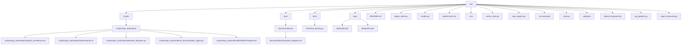

```mermaid
graph TD;
    scripts["scripts"] --> scripts_repo_automation["scripts/repo_automation"];
    root["root"] --> scripts["scripts"];
    root["root"] --> docs["docs"];
    root["root"] --> tests["tests"];
    root["root"] --> data["data"];
    root["root"] --> README_md["README.md"];
    root["root"] --> aipipe_client_py["aipipe_client.py"];
    root["root"] --> models_py["models.py"];
    root["root"] --> requirements_txt["requirements.txt"];
    root["root"] --> _env[".env"];
    root["root"] --> vector_store_py["vector_store.py"];
    root["root"] --> repo_graph_json["repo_graph.json"];
    root["root"] --> _env_example[".env.example"];
    root["root"] --> main_py["main.py"];
    root["root"] --> _gitignore[".gitignore"];
    root["root"] --> docker_compose_yml["docker-compose.yml"];
    root["root"] --> rag_pipeline_py["rag_pipeline.py"];
    root["root"] --> ingest_discourse_py["ingest_discourse.py"];
    docs["docs"] --> docs_architecture["docs/architecture"];
    tests["tests"] --> tests_test_dummy_py["tests/test_dummy.py"];
    data["data"] --> data_index_pkl["data/index.pkl"];
    data["data"] --> data_posts_json["data/posts.json"];
    scripts_repo_automation["scripts/repo_automation"] --> scripts_repo_automation_analyze_architecture_py["scripts/repo_automation/analyze_architecture.py"];
    scripts_repo_automation["scripts/repo_automation"] --> scripts_repo_automation_requirements_txt["scripts/repo_automation/requirements.txt"];
    scripts_repo_automation["scripts/repo_automation"] --> scripts_repo_automation_generate_diagrams_py["scripts/repo_automation/generate_diagrams.py"];
    scripts_repo_automation["scripts/repo_automation"] --> scripts_repo_automation_ai_documentation_agent_py["scripts/repo_automation/ai_documentation_agent.py"];
    scripts_repo_automation["scripts/repo_automation"] --> scripts_repo_automation_README_template_md["scripts/repo_automation/README.template.md"];
    docs_architecture["docs/architecture"] --> docs_architecture_system_diagram_md["docs/architecture/system_diagram.md"];
```